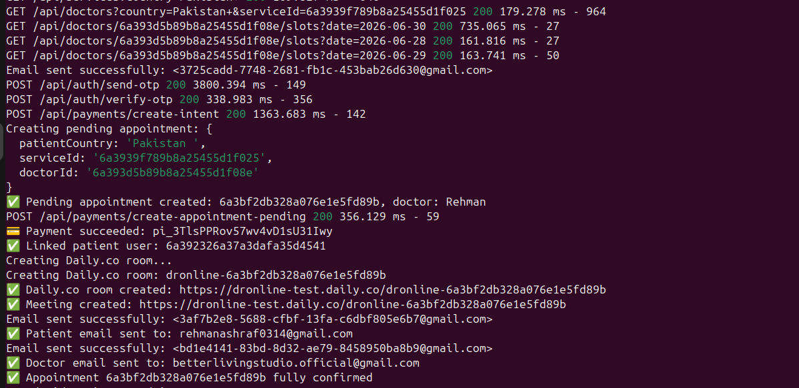

# 🩺 Dr. Online Mobile App  ANdroid,IOS (expo React Native). Backend in the node.js, MongoDB

A robust, full-fledged telemedicine platform that bridges the gap between doctors and patients. This application streamlines the entire healthcare experience—from finding a specialist and securely processing payments via Stripe, to tracking appointment histories and managing operations through a powerful administrative dashboard.

---

## 🚀 Key Features

*   **Secure Payment Integration:** Seamless financial transactions powered by **Stripe** for reliable appointment booking.
*   **OTP Email Verification:** Enhanced security during onboarding via One-Time Password (OTP) email verification.
*   **Role-Based Dashboards:** Specialized environments for **Patients**, **Doctors**, and **Admins** to perform their distinct tasks.
*   **Comprehensive Admin Portal:** A central control center for total management of users, bookings, and platform analytics.
*   **Automated Appointment Tracking:** Real-time logging and status updates for all patient-doctor interactions.

---

## 📱 Visual Showcase & Proof of Concept

### 🔹 User Interface
Take a look at the modern, intuitive frontend interface designed for seamless user navigation.

### 🔹 Appointment Booking Flow
Watch how easily patients can browse available slots and secure their medical appointments in real-time.

<video src="appointment_making.mp4" width="100%" controls>
  Your browser does not support the video tag.
</video>

### 🔹 Secure Stripe Payments
This video demonstrates the smooth client-side integration of Stripe, providing safe checkout experiences.

<video src="payment_processing.mp4" width="100%" controls>
  Your browser does not support the video tag.
</video>

### 🔹 Full-Fledged Admin Portal
An inside look at the administrative control panel used to oversee the entire ecosystem efficiently.

<video src="admin_portal.mp4" width="100%" controls>
  Your browser does not support the video tag.
</video>

---

## ⚙️ Backend & Architecture Proofs

The system is backed by a highly secure and optimized server. Below are logs and execution proofs confirming that authentication, booking databases, and payment hooks function flawlessly.

### 🔌 Server Operations & Routing
*Server spinning up and handling core data flows successfully:*

### 👥 User & Session Management
*Authentication handling, active database connections, and session controls:*

### 💳 Stripe Webhook & Payment Logic
*Backend verifying incoming transactions and updating appointment records automatically:*

---

## 🛠️ Tech Stack

*   **Frontend:** Modern Component Framework (React / Next.js / Mobile App Framework)
*   **Backend:** Node.js, Express
*   **Database:** Secure Relational / Non-Relational Database Management System
*   **Authentication:** OTP via Email Service
*   **Payment Gateway:** Stripe API

---
