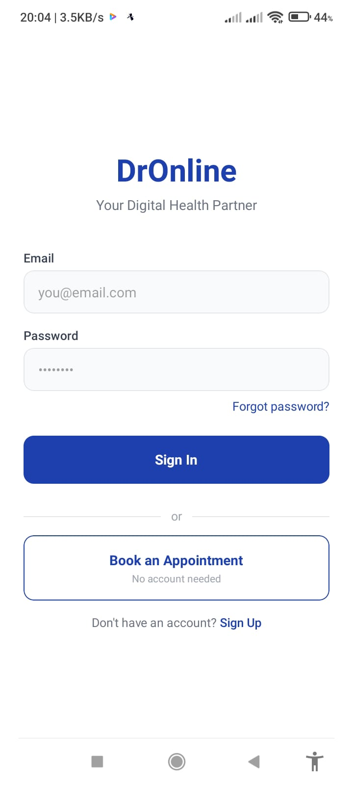
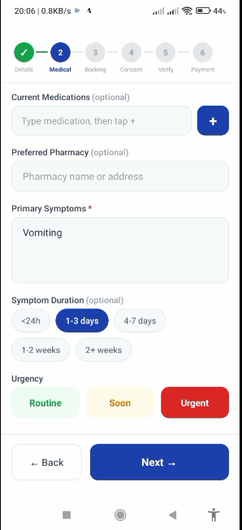
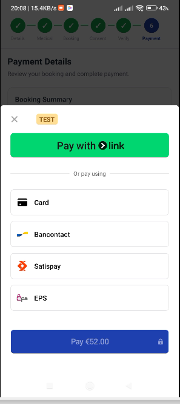
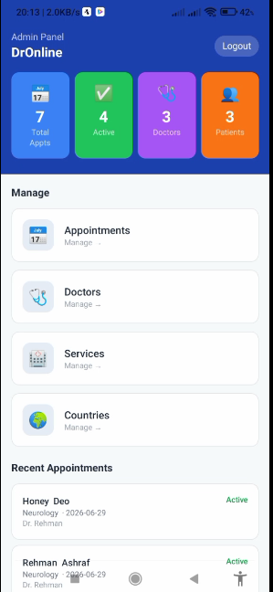
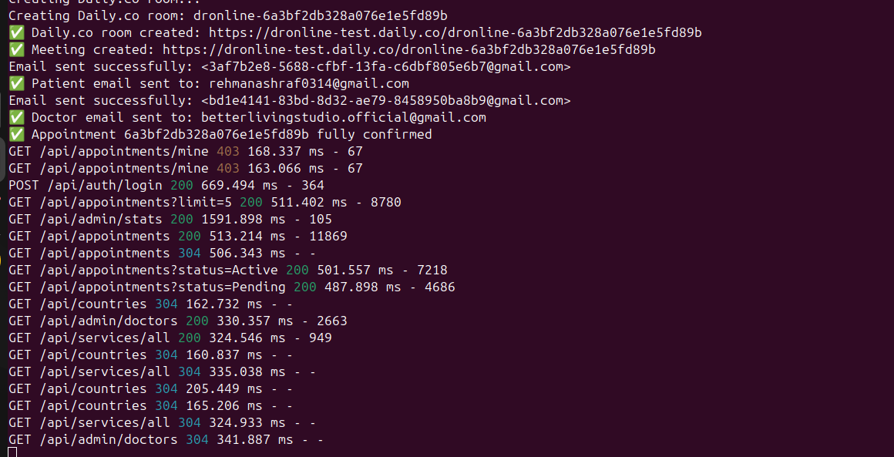
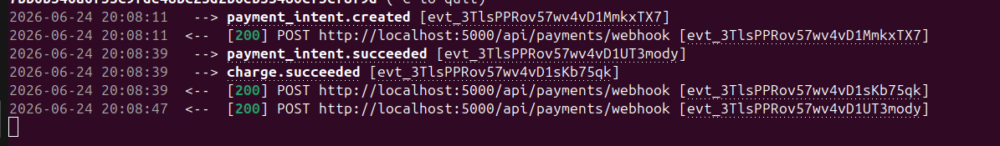

# 🩺 Dr. Online Mobile App (Android & iOS)
### Developed using Expo React Native, Node.js, and MongoDB

A robust, full-fledged telemedicine platform that bridges the gap between doctors and patients. This application streamlines the entire healthcare experience—from finding a specialist and securely processing payments via Stripe, to tracking appointment histories and managing operations through a powerful administrative dashboard.

---

## 🚀 Key Features

* **Secure Payment Integration:** Seamless financial transactions powered by **Stripe** for reliable appointment booking.
* **OTP Email Verification:** Enhanced security during onboarding via One-Time Password (OTP) email verification.
* **Role-Based Dashboards:** Specialized environments for **Patients**, **Doctors**, and **Admins** to perform their distinct tasks.
* **Comprehensive Admin Portal:** A central control center for total management of users, bookings, and platform analytics.
* **Automated Appointment Tracking:** Real-time logging and status updates for all patient-doctor interactions.

---

## 📱 Visual Showcase & Proof of Concept

### 🔹 User Interface
Take a look at the modern, intuitive frontend interface designed for seamless user navigation.

---

### 🔹 Appointment Booking Flow
Watch how easily patients can browse available slots and secure their medical appointments in real-time.

 
📺 **[Click here to watch the working video demonstration](https://github.com/rehmanashraf0314/dronline_app/working_samples/appointment_making.mp4)**

---

### 🔹 Secure Stripe Payments
This demonstration shows the smooth client-side integration of Stripe, providing safe checkout experiences.

 
📺 **[Click here to watch the working video demonstration](https://github.com/rehmanashraf0314/dronline_app/working_samples/payment_processing.mp4)**

---

### 🔹 Full-Fledged Admin Portal
An inside look at the administrative control panel used to oversee the entire ecosystem efficiently.

 
📺 **[Click here to watch the working video demonstration](https://github.com/rehmanashraf0314/dronline_app/working_samples/Admin_portal.mp4)**

---

## ⚙️ Backend & Architecture Proofs

The system is backed by a highly secure and optimized server. Below are logs and execution proofs confirming that authentication, booking databases, and payment hooks function flawlessly.

### 🔌 Server Operations & Routing
*Server spinning up and handling core data flows successfully:*
 

### 👥 User & Session Management
*Authentication handling, active database connections, and session controls:*
 

### 💳 Stripe Webhook & Payment Logic
*Backend verifying incoming transactions and updating appointment records automatically:*
 

---

## 🛠️ Tech Stack

* **Frontend:** React Native (Expo)
* **Backend:** Node.js, Express.js
* **Database:** MongoDB
* **Authentication:** OTP via Email Service (Nodemailer)
* **Payment Gateway:** Stripe API
